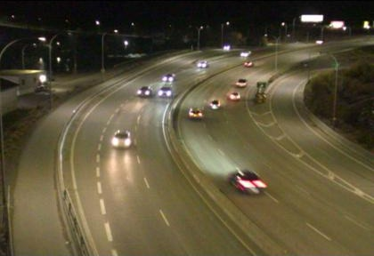

# Traffic Net

This project aims to detect anomaly traffic patterns across the William R. Bennett Bridge. Images are sourced from the [DriveBC website](https://images.drivebc.ca/bchighwaycam/pub/html/www/147.html), where images are uploaded at 2-minute intervals. The goal is to use object detection models to automate the traffic count within an image. This produces time series features that can be leveraged by a time series model for further analysis of traffic data.

<p align="center">
    
</p>
<p align="center"><em>Arial view of the William R. Bennett Bridge</em></p>


## Running the pipeline

To run the entire pipeline use the following command:
```sh
docker-compose -f docker-compose.yml up --build
```

## Pipeline structure 

The pipeline has three main components:

1. [Data ingestion](/data_ingestion)
2. [Object detection](/object_detection) 
3. [Anomaly detection](/anomaly_detection/) 

Each component is run seperately using docker containers. 

## [Data ingestion](/data_ingestion/)

The data ingestion component performs the following functions:

- Fetches images to be downloaded from the [DriveBC website](https://images.drivebc.ca/bchighwaycam/pub/html/www/147.html)
- Performs image preprocessing to prepare it for object detection in the next component. 

## [Object detection](/object_detection/) 

The object detection generates raw time series data relating to traffic flow. It does so by performing the following steps:

- Use object detection to get the bounding boxes of cars on traffic images
- Save bounding box information such as incoming and outgoing traffic data to a csv

<p align="center">
  
  
</p>
<p align="center"><em>Sample image with bounding boxes</em></p>


## [Anomaly detection](/anomaly_detection/) (In progress)

This is the last component of the pipeline. Here anomaly events in traffic are flagged by comparing forecasted traffic with the actual traffic data. 
The following steps are carried out in this component:
- Temporally aggregate time series data to reveal trends
- Forecast future traffic trends using a rolling average model 
- Compare the real and forecasted trends to flag anomalies (coming soon!)
- Display live trends (coming soon!)

<p align="center">
    
</p>
<p align="center"><em>Time series plot of traffic data</em></p>
